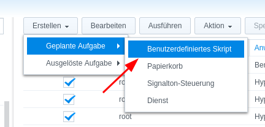
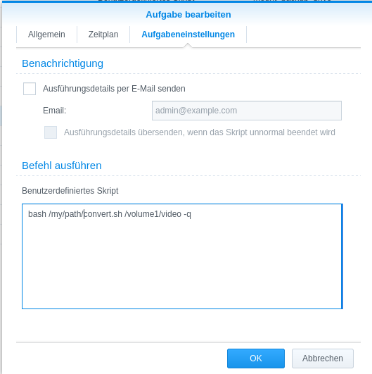
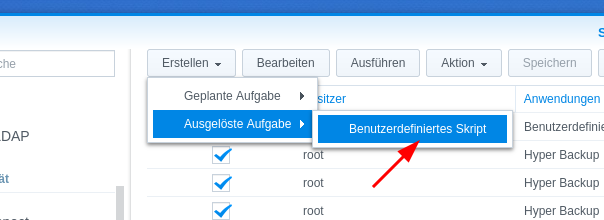
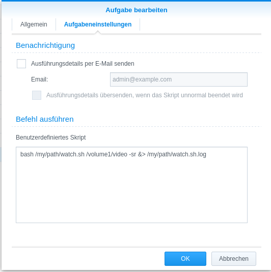

# synology-videostation-converter

This script converts your DTS audio stream to AC3, so the VideoStation can stream it to your FireTV DSVideo App 

```
#----------------------------------------------------------------------------------------------------------------------#
# this script requires the synocommunity inotify-tools package see: https://synocommunity.com/package/inotify-tools
# please check https://synocommunity.com/ Easy Install guidelines
#----------------------------------------------------------------------------------------------------------------------#
Usage: ./watch.sh <directory> [-r <recursive>] [-q <quiet>] [-s <scan>] [-h <help>]
-r: scan directory recursive
-q: no output to stdout
-s: scan directory for unconverted files before watch
```

```
#----------------------------------------------------------------------------------------------------------------------#
# this script requires the synocommunity ffmpeg package see: https://synocommunity.com/package/ffmpeg
# please check https://synocommunity.com/ Easy Install guidelines
# if you use other ffmpeg binaries, make sure hey are able to decode DTS, otherwise the ac3 audio track will remain silent
#----------------------------------------------------------------------------------------------------------------------#
Usage: ./convert.sh <source> [-h <help>] [-d <delete original>] [-s <show stats>] [-v <verbose>] [-q <quiet>]
-d: delete original file after convert ist successful (not recommended)
-s: shows convert progress
-v: display additional information
-q: no output to stdout
```

### Cron Job
```
bash /my/path/convert.sh /volume1/video -q
```



### Watch job on Synology start
```
bash /my/path/watch.sh /volume1/video -sr &> /my/path/watch.sh.log
```

